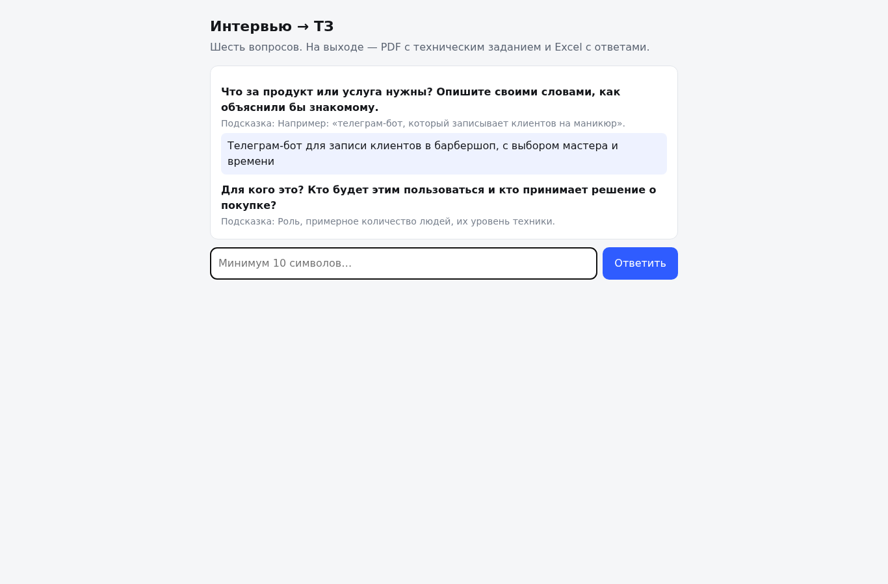

# Интервью → ТЗ (демо)


Веб-приложение, которое проводит короткое интервью из шести вопросов и на выходе отдаёт **готовое техническое задание в PDF** плюс **выгрузку ответов в Excel**. Смысл демо: показать, как из разговора с заказчиком получается документ, по которому можно работать и принимать результат.



## Что внутри

| Часть | Роль |
|---|---|
| `app/questions.py` | 6 вопросов с обязательностью и минимальной длиной ответа |
| `app/store.py` | SQLite: сессии и ответы, одна строка на (сессия, вопрос) |
| `app/pdf.py` | PDF-ТЗ: шапка, блоки «вопрос → ответ», раздел **«Что уточнить у заказчика»** |
| `app/main.py` | FastAPI: чат-UI, REST, PDF и Excel на выходе |
| `tests/` | 13 тестов: путь до PDF, границы валидации (404/409/422), содержимое Excel, Telegram-бот на локальном стенде |
| `app/telegram_bot.py`, `tools/fake_tg_api.py` | то же интервью в Telegram; локальный стенд Bot API — чтобы прогонять без сети |
| `.github/workflows/ci.yml` | pytest на Python 3.11 и 3.12 |

Раздел «Что уточнить у заказчика» не выдумывается моделью: это детерминированные правила по ответам. Если в бюджете нет суммы, попросит зафиксировать диапазон; если в критерии готовности нет проверяемого действия («открываю… и вижу…») — попросит его описать. Так ТЗ остаётся честным: где данных нет, там стоит вопрос, а не догадка.

## Запуск

```bash
python3 -m venv .venv && . .venv/bin/activate
pip install -r requirements.txt
uvicorn app.main:app --reload
# http://127.0.0.1:8000/
```

Кириллица в PDF рисуется шрифтом `app/fonts/DejaVuSans.ttf` (шрифт ищется также в системных путях DejaVu).

## API

| Метод | Путь | Что делает |
|---|---|---|
| `GET` | `/` | чат-интервью в браузере |
| `POST` | `/api/session` | создать сессию, вернуть первый вопрос |
| `GET` | `/api/session/{id}` | состояние: сколько ответов, какой вопрос следующий |
| `POST` | `/api/answer` | принять ответ; `422` — пусто или короче минимума, `409` — интервью уже закончено |
| `GET` | `/api/spec/{id}.pdf` | ТЗ в PDF; до последнего ответа — `409` |
| `GET` | `/api/spec/{id}.xlsx` | выгрузка ответов; до последнего ответа — `409` |

## Живой прогон (реальный вывод, не выдуманный)

```
$ curl -s -X POST http://127.0.0.1:8099/api/session
{"session_id":"c18808b77d7c4a3abbb7bc22456605e9", ... "question":{"id":"product", ...}}

$ curl -s -X POST http://127.0.0.1:8099/api/answer -H 'Content-Type: application/json' \
    -d '{"session_id":"c18808...","answer":"Телеграм-бот для записи клиентов в барбершоп, с выбором мастера и времени"}'
answers 1 complete False next audience
... через 6 ответов ...
answers 6 complete True next None

$ curl -s -o /tmp/spec.pdf -w "HTTP %{http_code} %{size_download}b type=%{content_type}\n" \
    http://127.0.0.1:8099/api/spec/c18808b77d7c4a3abbb7bc22456605e9.pdf
HTTP 200 24680b type=application/pdf
$ curl -s -o /tmp/ans.xlsx -w "HTTP %{http_code} %{size_download}b type=%{content_type}\n" \
    http://127.0.0.1:8099/api/spec/c18808b77d7c4a3abbb7bc22456605e9.xlsx
HTTP 200 5791b type=application/vnd.openxmlformats-officedocument.spreadsheetml.sheet

$ curl -s -o /dev/null -w "pdf HTTP %{http_code}\n" http://127.0.0.1:8099/api/spec/<новая-сессия>.pdf
pdf HTTP 409                                   # до конца интервью ТЗ не выдаётся
$ curl -s -X POST http://127.0.0.1:8099/api/answer -H 'Content-Type: application/json' \
    -d '{"session_id":"<новая-сессия>","answer":"бот"}'
{"detail":"Слишком короткий ответ: нужно минимум 15 символов"}   # HTTP 422
```

## Telegram (интервью → ТЗ)

Есть Telegram-обвязка для того же демо из 6 вопросов. Бот валидирует ответы по тем же правилам, что и веб-версия, и в конце отправляет PDF документом через `sendDocument`.

Зависимость одна: `python-telegram-bot` (уже в `requirements.txt`).

### Как запустить

```bash
TELEGRAM_BOT_TOKEN="<ваш_токен>" \
python3 -m app.telegram_bot
```

Запускать именно контроллером (`-m app.telegram_bot`): при запуске файлом относительные импорты внутри пакета не работают.

Переменные окружения:

- `TELEGRAM_BOT_TOKEN` — токен бота. Если не задан, бот завершится с понятной ошибкой и кодом возврата 2.
- `TELEGRAM_BASE_URL` — база Bot API. По умолчанию `https://api.telegram.org/bot`. В демо-прогонах подставляется локальный стенд.
- `INTERVIEW_DB` — путь к SQLite. По умолчанию `data/interview.db`.

### Сквозной прогон без сети

```bash
python3 tools/run_bot_e2e.py
```

Прогон поднимает локальный стенд Bot API на свободном порту, запускает бота с `TELEGRAM_BASE_URL`
на этот стенд, отправляет 6 ответов (один — слишком короткий, бот должен переспросить) и проверяет
по журналу стенда, что ушёл `sendDocument`, а файл начинается с `%PDF` и читается. К настоящему
`api.telegram.org` прогон не обращается; печатает `PASS`/`FAIL`, код возврата 0/1 — годится для CI.

## Тесты

```
$ pytest -q
.............                                                            [100%]
13 passed, 1 warning in 25.60s
```

## Лицензия

MIT.
